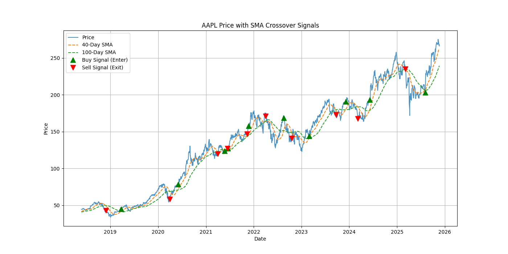
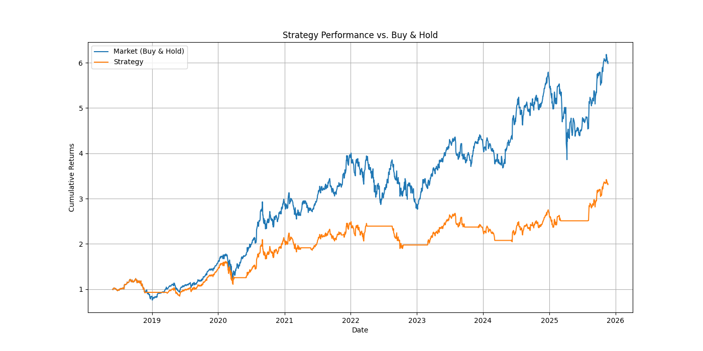

#  My First Quant Trading Bot

This is my first shot at building a "quant" project. I wanted to see if I could use Python to backtest a real trading strategy.

It uses the classic **Simple Moving Average (SMA) Crossover**. The logic is pretty simple:
* **Buy Signal :** When the short-term (50-day) average price crosses *above* the long-term (200-day) average.
* **Sell Signal :** When the short-term average crosses *below* the long-term average.

## Why I Built This

I'm teaching myself how to use Python for finance and data. This project was the perfect way to learn how to:
* Grab real stock data from the internet (with `yfinance`)
* Clean up and organize time-series data (with `pandas`)
* Calculate indicators and create buy/sell signals (with `numpy`)
* Plot everything to see if it actually worked (with `matplotlib`)

## Tech Stack
* Python
* pandas
* numpy
* yfinance
* matplotlib

## How to Run It

1.  Clone this repo.
2.  Set up a virtual environment (it's good practice!):
    ```bash
    python -m venv venv
    ```
    Activate it:
    ```bash
    # On Windows
    .\venv\Scripts\activate
    
    # On Mac/Linux
    source venv/bin/activate
    ```
3.  Install the packages:
    ```bash
    pip install -r requirements.txt
    ```
4.  Just run the script!
    ```bash
    python sma_strategy.py
    ```
5.  Two charts will pop up showing the trades and the final score.

## The Results (for AAPL)

So... did it actually work?

When I ran it on Apple stock (`AAPL`) from 2018, here's what I got:


* **My Strategy's Return:** 330.92%
* **"Buy & Hold" Return:** 598.11%

It **did not** beat the market, but honestly, that's what I expected. This strategy is super simple and doesn't account for things like trading fees, slippage, or big market events. The main goal was just to build the backtester itself, and that part worked perfectly.

Here are the charts my script generated:

### Strategy Signals


### Performance vs. Buy & Hold


Feel free to open `sma_strategy.py` and change the ticker or the dates at the bottom to test it on your own.